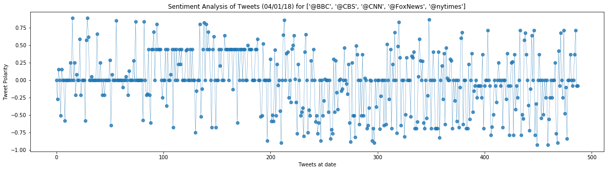
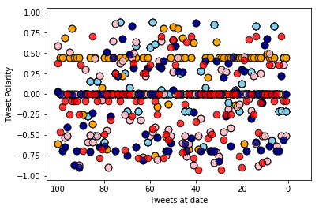
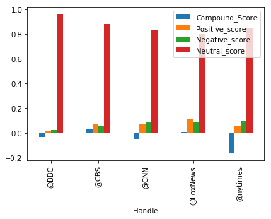

```python
# Dependencies
import tweepy
import json
import numpy as np
import pandas as pd
import matplotlib.pyplot as plt
from datetime import datetime
#from matplotlib.finance import date2num
import time
import seaborn as sns

from config import consumer_key, consumer_secret, access_token, access_token_secret
```


```python
# Import and Initialize Sentiment Analyzer
from vaderSentiment.vaderSentiment import SentimentIntensityAnalyzer
analyzer = SentimentIntensityAnalyzer()
```


```python
# Twitter API Keys
consumer_key = consumer_key
consumer_secret = consumer_secret
access_token = access_token
access_token_secret = access_token_secret
```


```python
# Setup Tweepy API Authentication
auth = tweepy.OAuthHandler(consumer_key, consumer_secret)
auth.set_access_token(access_token, access_token_secret)
api = tweepy.API(auth, parser=tweepy.parsers.JSONParser())
```


```python
# Loop through all tweets

twf = pd.DataFrame()
twf.tz_localize('UTC').tz_convert('US/Pacific')
counter = 0
# Create list of Twitter handles
target_terms= ["@BBC", "@CBS" ,"@CNN", "@FoxNews" , "@nytimes"]

for x in target_terms:    
    #print("---------->>>>>>>",x)  
    public_tweets = api.search(x, count=100, result_type="recent")
    #print(public_tweets)
    
    for tweet in public_tweets["statuses"]:
        #print(tweet["text"])
        #Run Vader Analysis on each tweet
        #datetime.strptime(raw_time, "%a %b %d %H:%M:%S %z %Y")
        compound = analyzer.polarity_scores(tweet["text"])["compound"]
        pos = analyzer.polarity_scores(tweet["text"])["pos"]
        neg = analyzer.polarity_scores(tweet["text"])["neg"]
        neu = analyzer.polarity_scores(tweet["text"])["neu"]
        #print("done")
       # print(tweet["created_at"])
       # print(datetime.strptime(tweet["created_at"], "%a %b %d %H:%M:%S %z %Y").strftime('%m/%d/%Y %H:%M:%S'))
        twf.loc[counter,'Handle'] = x
        twf.loc[counter,'Date'] = tweet["created_at"]
        twf.loc[counter,'Text'] = tweet["text"]
        twf.loc[counter,'Compound_Score'] = compound
        twf.loc[counter,'Positive_score'] = pos
        twf.loc[counter,'Negative_score'] = neg
        twf.loc[counter,'Neutral_score'] = neu
        #print(datetime.strptime(tweet["created_at"], "%a %b %d %H:%M:%S %z %Y"))
        counter = counter+1  

        
twf.to_csv("Sentiment_analysis.csv")

#converts the datetime object from a string
twf["Date"]=pd.to_datetime(twf["Date"])

twf.head() 

```


<div>
<style>
    .dataframe thead tr:only-child th {
        text-align: right;
    }

    .dataframe thead th {
        text-align: left;
    }

    .dataframe tbody tr th {
        vertical-align: top;
    }
</style>
<table border="1" class="dataframe">
  <thead>
    <tr style="text-align: right;">
      <th></th>
      <th>Handle</th>
      <th>Date</th>
      <th>Text</th>
      <th>Compound_Score</th>
      <th>Positive_score</th>
      <th>Negative_score</th>
      <th>Neutral_score</th>
    </tr>
  </thead>
  <tbody>
    <tr>
      <th>0</th>
      <td>@BBC</td>
      <td>2018-04-02 23:22:44</td>
      <td>RT @carolecadwalla: Here's the New Yorker cove...</td>
      <td>0.0000</td>
      <td>0.0</td>
      <td>0.000</td>
      <td>1.000</td>
    </tr>
    <tr>
      <th>1</th>
      <td>@BBC</td>
      <td>2018-04-02 23:22:38</td>
      <td>@BrutalVeracity @DonnaWe51549635 @Eagle5042584...</td>
      <td>0.0000</td>
      <td>0.0</td>
      <td>0.000</td>
      <td>1.000</td>
    </tr>
    <tr>
      <th>2</th>
      <td>@BBC</td>
      <td>2018-04-02 23:22:31</td>
      <td>RT @DrMahmoudRefaat: #Egypt: #Sisi pretends 24...</td>
      <td>-0.3818</td>
      <td>0.0</td>
      <td>0.175</td>
      <td>0.825</td>
    </tr>
    <tr>
      <th>3</th>
      <td>@BBC</td>
      <td>2018-04-02 23:22:24</td>
      <td>@DonnaWe51549635 @Eagle50425849 @cjsienna55 @I...</td>
      <td>0.0000</td>
      <td>0.0</td>
      <td>0.000</td>
      <td>1.000</td>
    </tr>
    <tr>
      <th>4</th>
      <td>@BBC</td>
      <td>2018-04-02 23:22:24</td>
      <td>RT @carolecadwalla: Here's the New Yorker cove...</td>
      <td>0.0000</td>
      <td>0.0</td>
      <td>0.000</td>
      <td>1.000</td>
    </tr>
  </tbody>
</table>
</div>


```python
# Create plot
plt.figure(figsize=(20,5))
plt.plot(np.arange(len(twf["Compound_Score"])),
        twf["Compound_Score"], marker="o", linewidth=0.5,
         alpha=0.8)

# # Incorporate the other graph properties
plt.title("Sentiment Analysis of Tweets (%s) for %s" % (time.strftime("%x"), target_terms))
plt.ylabel("Tweet Polarity")
plt.xlabel("Tweets at date")
plt.show()
```





```python
# Create plot
plt.scatter(np.arange(-len(twf[twf["Handle"] == "@BBC"]), 0, 1), 
  twf[twf["Handle"] == "@BBC"]["Compound_Score"],
  edgecolor="black", linewidths=1, marker="o", color="skyblue", s=75,
  alpha=0.8, label="BBC")
plt.ylabel("Tweet Polarity")
plt.xlabel("Tweets at date")
plt.xlim([-105, 10])
plt.xticks([-100, -80, -60, -40, -20, 0], [100, 80, 60, 40, 20, 0])
plt.ylim([-1.05, 1.05])

plt.scatter(np.arange(-len(twf[twf["Handle"] == "@BBC"]), 0, 1), 
  twf[twf["Handle"] == "@BBC"]["Compound_Score"],
  edgecolor="black", linewidths=1, marker="o", color="skyblue", s=75,
  alpha=0.8, label="BBC")

plt.scatter(np.arange(-len(twf[twf["Handle"] == "@CBS"]), 0, 1), 
  twf[twf["Handle"] == "@CBS"]["Compound_Score"],
  edgecolor="black", linewidths=1, marker="o", color="orange", s=75,
  alpha=0.8, label="@CBS")

plt.scatter(np.arange(-len(twf[twf["Handle"] == "@CNN"]), 0, 1), 
  twf[twf["Handle"] == "@CNN"]["Compound_Score"],
  edgecolor="black", linewidths=1, marker="o", color="pink", s=75,
  alpha=0.8, label="@CNN")

plt.scatter(np.arange(-len(twf[twf["Handle"] == "@FoxNews"]), 0, 1), 
  twf[twf["Handle"] == "@FoxNews"]["Compound_Score"],
  edgecolor="black", linewidths=1, marker="o", color="darkblue", s=75,
  alpha=0.8, label="@FoxNews")


plt.scatter(np.arange(-len(twf[twf["Handle"] == "@nytimes"]), 0, 1), 
  twf[twf["Handle"] == "@nytimes"]["Compound_Score"],
  edgecolor="black", linewidths=1, marker="o", color="red", s=75,
  alpha=0.8, label="@nytimes")


plt.show()
```





```python
twf.groupby("Handle").mean()


```


<div>
<style>
    .dataframe thead tr:only-child th {
        text-align: right;
    }

    .dataframe thead th {
        text-align: left;
    }

    .dataframe tbody tr th {
        vertical-align: top;
    }
</style>
<table border="1" class="dataframe">
  <thead>
    <tr style="text-align: right;">
      <th></th>
      <th>Compound_Score</th>
      <th>Positive_score</th>
      <th>Negative_score</th>
      <th>Neutral_score</th>
    </tr>
    <tr>
      <th>Handle</th>
      <th></th>
      <th></th>
      <th></th>
      <th></th>
    </tr>
  </thead>
  <tbody>
    <tr>
      <th>@BBC</th>
      <td>-0.033553</td>
      <td>0.012890</td>
      <td>0.022320</td>
      <td>0.964800</td>
    </tr>
    <tr>
      <th>@CBS</th>
      <td>0.026314</td>
      <td>0.065364</td>
      <td>0.050761</td>
      <td>0.883875</td>
    </tr>
    <tr>
      <th>@CNN</th>
      <td>-0.050813</td>
      <td>0.070010</td>
      <td>0.091670</td>
      <td>0.838310</td>
    </tr>
    <tr>
      <th>@FoxNews</th>
      <td>0.005228</td>
      <td>0.111930</td>
      <td>0.087020</td>
      <td>0.801040</td>
    </tr>
    <tr>
      <th>@nytimes</th>
      <td>-0.169650</td>
      <td>0.048020</td>
      <td>0.098310</td>
      <td>0.853660</td>
    </tr>
  </tbody>
</table>
</div>


```python
%matplotlib inline

```


```python
twf.groupby("Handle").mean().plot(kind='bar')
```


    <matplotlib.axes._subplots.AxesSubplot at 0x1c9b1a903c8>





```python
twf.tail()

```


<div>
<style>
    .dataframe thead tr:only-child th {
        text-align: right;
    }

    .dataframe thead th {
        text-align: left;
    }

    .dataframe tbody tr th {
        vertical-align: top;
    }
</style>
<table border="1" class="dataframe">
  <thead>
    <tr style="text-align: right;">
      <th></th>
      <th>Handle</th>
      <th>Date</th>
      <th>Text</th>
      <th>Compound_Score</th>
      <th>Positive_score</th>
      <th>Negative_score</th>
      <th>Neutral_score</th>
    </tr>
  </thead>
  <tbody>
    <tr>
      <th>480</th>
      <td>@nytimes</td>
      <td>59</td>
      <td>RT @amyep9: Also, @nytimes labeled this photo ...</td>
      <td>0.0000</td>
      <td>0.000</td>
      <td>0.0</td>
      <td>1.000</td>
    </tr>
    <tr>
      <th>481</th>
      <td>@nytimes</td>
      <td>56</td>
      <td>Great response to (yet another) whack @nytimes...</td>
      <td>0.6249</td>
      <td>0.272</td>
      <td>0.0</td>
      <td>0.728</td>
    </tr>
    <tr>
      <th>482</th>
      <td>@nytimes</td>
      <td>53</td>
      <td>@lettieri_mike @thecjpearson @cmg_48 @foxandfr...</td>
      <td>0.0000</td>
      <td>0.000</td>
      <td>0.0</td>
      <td>1.000</td>
    </tr>
    <tr>
      <th>483</th>
      <td>@nytimes</td>
      <td>48</td>
      <td>RT @nytimes: Pope Celebrates Easter Mass With ...</td>
      <td>0.8020</td>
      <td>0.340</td>
      <td>0.0</td>
      <td>0.660</td>
    </tr>
    <tr>
      <th>484</th>
      <td>@nytimes</td>
      <td>44</td>
      <td>How Memphis Gave Up on Dr. King’s Dream   via ...</td>
      <td>0.2500</td>
      <td>0.167</td>
      <td>0.0</td>
      <td>0.833</td>
    </tr>
  </tbody>
</table>
</div>


